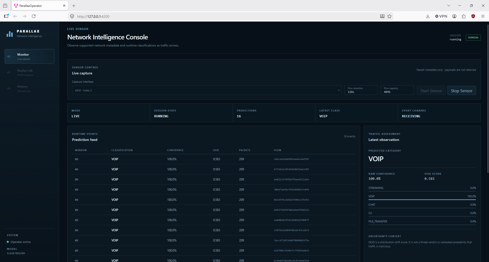
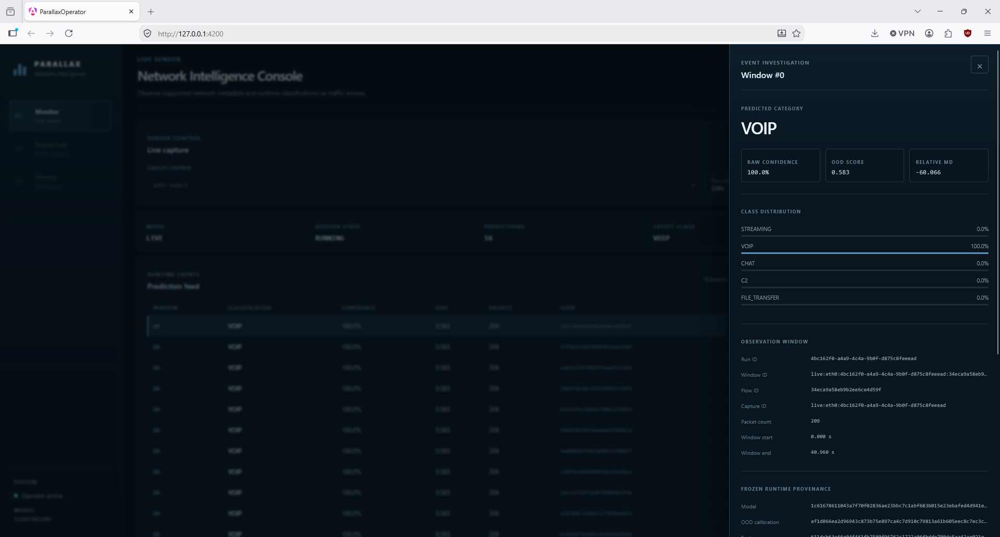
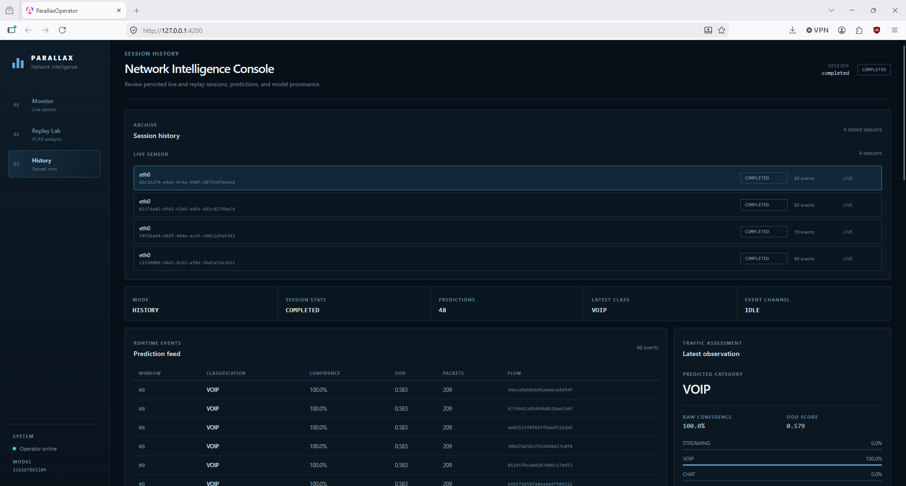

# Parallax

**Privacy-conscious network traffic classification with uncertainty-aware inference, live sensing, and a real-time operator console.**

Parallax is an end-to-end network traffic intelligence system that classifies broad application activity from observable packet metadata such as timing, size, and direction without decrypting or persisting packet payloads.

It began as a reproducibility-focused machine-learning project around MIT Lincoln Laboratory's VNAT dataset and evolved into a complete runtime system: deterministic raw-PCAP processing, leakage-resistant data partitions, a frozen uncertainty-aware classifier, replay, live Linux capture, least-privilege sensor isolation, REST/SSE services, an Angular operations console, durable history, sustained-load validation, and an as-built threat model.

> **Project status:** Milestones 1 through 6 are complete. Milestone 7 is preparing the repository for its first portfolio release.

## What Parallax demonstrates

Parallax is intentionally more than a notebook classifier.

The project demonstrates how an ML experiment can be carried through data engineering, model evaluation, runtime parity, systems integration, security boundaries, observability, failure handling, and live operation while preserving scientific and privacy constraints.

Key engineering properties include:

- deterministic capture-grouped train/validation/calibration/test partitions;
- a versioned 129-feature encrypted-traffic representation;
- conventional baselines and a frozen prototypical classifier;
- independent relative-Mahalanobis OOD scoring;
- exact selected-capture offline/runtime feature parity;
- replay and live traffic through the same feature/inference path;
- a dedicated CAP_NET_RAW sensor instead of privileged API execution;
- bounded metadata-only AF_UNIX sensor IPC;
- FastAPI REST/SSE operator services;
- an Angular operations console with live recovery and history;
- bounded flow state and explicit capacity failures;
- restart-safe SQLite operational history;
- 100% Python statement/branch coverage;
- deterministic synthetic soak testing;
- real privilege-separated live acceptance testing;
- a documented security/privacy threat model.

## Operator console

Parallax includes a real-time Angular operations console for live monitoring,
prediction investigation, replay, and persisted session history.

### Live network monitoring



The Live Sensor workspace starts and stops supported interfaces, reports
runtime/session state, streams prediction events over SSE, and presents
closed-set classification and OOD information separately.

### Prediction investigation



Every prediction can be inspected beyond its headline class. The investigation
view exposes the full five-class distribution, raw confidence, OOD score,
relative-Mahalanobis value, observation-window identity, packet count, timing,
and checksum-bound model/calibration provenance.

### Durable session history



Completed live and replay sessions remain available through restart-safe
SQLite history. Historical prediction events can be reopened and investigated
without reviving the original capture session.

For a reproducible walkthrough, see the
[Portfolio Demo Runbook](docs/demo-runbook.md).

## Architecture

```mermaid
flowchart LR
    A["Local Network Interface"] --> B["parallax-sensor<br/>AF_PACKET + CAP_NET_RAW"]
    B --> C["Ethernet / IPv4 Decoder"]
    C --> D["PacketMetadata"]
    D --> E["AF_UNIX IPC<br/>metadata only"]

    E --> F["Unprivileged Operator"]
    F --> G["Bidirectional Flow Tracking"]
    G --> H["Observation Windows"]
    H --> I["129-Feature Runtime"]
    I --> J["Frozen Prototype Classifier"]
    I --> K["Frozen OOD Calibration"]

    J --> L["RuntimePredictionEvent"]
    K --> L

    L --> M["REST / SSE"]
    M --> N["Angular Operations Console"]

    L --> O["SQLite History<br/>owner-only"]
```



The raw-capture privilege boundary is deliberately narrow:

```text
PRIVILEGED
local interface -> AF_PACKET -> decode -> PacketMetadata
                                      |
                                      v
                              AF_UNIX boundary
                                      |
UNPRIVILEGED                          v
operator -> flows -> windows -> features -> model/OOD -> REST/SSE -> browser
```

Raw Ethernet frames remain inside the sensor process. Packet payload bytes do not cross into the operator process or ordinary operational history.

## Validated results

### Runtime parity

Selected VNAT SSH and VoIP raw captures reproduce the offline flow/window/feature pipeline exactly under the accepted release-compatible contracts.

```text
maximum absolute feature difference: 0.0
```

The verified examples include:

- 5 eligible SSH observation windows;
- 45 eligible VoIP observation windows.

### Live system acceptance

A three-minute privilege-separated live run exercised the complete path:

```text
AF_PACKET
-> sensor
-> metadata IPC
-> unprivileged operator
-> flow/window/features
-> frozen model + OOD
-> SSE
-> SQLite
```

Recorded acceptance evidence:

| Measurement | Result |
| --- | ---: |
| Workload duration | 180.094985 s |
| Generated UDP datagrams | 28,704 |
| Configured generator flows | 16 |
| Final prediction events | 80 |
| SSE prediction events | 80 |
| Persisted prediction events | 80 |
| Terminal state | completed |
| Sensor sampled RSS growth | 0 KiB |
| Operator sampled RSS growth | 6,036 KiB |

The generated-datagram count is a workload-generator measurement, not a claim that the sensor processed exactly that many packets.

Full evidence is documented in [Performance and Soak Validation](docs/performance-report.md) and [Milestone 6 Acceptance](docs/milestone-6-acceptance.md).

### Quality gate

The accepted Milestone 6 repository state passed:

```text
Python tests:                 1,120
Python statement coverage:    100%
Python branch coverage:       100%
Angular tests:                   79
Ruff:                         clean
mypy:                         clean
Python package build:         green
Angular production build:     green
```

## Least-privilege live sensing

The FastAPI/model process does not receive packet-capture privileges.

Live capture is isolated in a dedicated systemd service running as `parallax-sensor` with only the capability required for raw packet capture:

```text
CAP_NET_RAW
```

The deployed service restricts socket families to AF_PACKET and AF_UNIX and communicates with the operator through `/run/parallax/sensor.sock`.

The operator itself was validated with no inherited, permitted, effective, or ambient Linux capabilities.

See [Sensor Service](docs/sensor-service.md) and [Threat Model and Security Review](docs/threat-model.md).

## Privacy model

Parallax processes traffic metadata, which can itself be sensitive.

The live operator may transiently process:

- source and destination addresses;
- ports;
- timestamps;
- packet sizes;
- packet directions;
- flow state;
- derived feature vectors.

However, the reviewed operational prediction history does not persist raw endpoint tuples, raw frames, payload bytes, or feature vectors.

A security review scanned 192 persisted live prediction events and found:

```text
IPv4-looking persisted strings: 0
MAC-looking persisted strings:  0
```

Operator-history databases are created owner-only (`0600`), and Parallax-created history directories use `0700`.

## Scientific boundaries

Parallax uses a frozen five-category closed set:

```text
STREAMING
VOIP
CHAT
C2
FILE_TRANSFER
```

Important interpretation limits:

- raw confidence is a softmax model preference, not a calibrated probability of factual correctness;
- OOD score is reported independently from predictive confidence;
- the accepted VNAT test set contained no true OOD examples;
- live traffic does not constitute new accuracy or OOD-generalization evidence;
- VNAT `C2` represents benign SSH/RDP traffic and is not evidence of malicious command-and-control detection;
- Parallax is not a malware detector, production IDS, enforcement system, or arbitrary Internet application classifier.

Any new OOD-generalization claim requires a separate preregistered experiment.

## Evidence and documentation

| Document | Purpose |
| --- | --- |
| [Portfolio Demo Runbook](docs/demo-runbook.md) | Reproducible live product walkthrough |
| [Milestone 6 Acceptance](docs/milestone-6-acceptance.md) | Final live-system acceptance record |
| [Performance and Soak Validation](docs/performance-report.md) | Load, memory, persistence, and restart evidence |
| [Threat Model and Security Review](docs/threat-model.md) | Trust boundaries, privacy findings, and residual risk |
| [Live Sensor Validation](docs/live-sensor-validation.md) | Live-interface and end-to-end validation |
| [Sensor Service](docs/sensor-service.md) | Least-privilege capture architecture |
| [Engineering Design](docs/engineering-design.md) | Full system architecture and requirements |
| [Model Card](docs/model-card.md) | Model behavior, metrics, and limitations |
| [Dataset Card](docs/dataset-card.md) | VNAT provenance, schema, and data limitations |
| [Uncertainty Modeling](docs/uncertainty-modeling.md) | Frozen model-selection, calibration, and test workflow |
| [Architecture Decisions](docs/adr/README.md) | Major engineering decisions |

## Development setup

Requirements:

- Python 3.12
- [uv](https://docs.astral.sh/uv/)
- Node.js 24.19.0
- npm 11.17.0

Install the locked development environment and run the command-line entry point:

```bash
uv sync --locked --all-groups
uv run --locked parallax
```

Install the Angular operator-console dependencies from its committed lockfile:

```bash
cd web
npm ci
cd ..
```

Inspect a verified VNAT release 1 raw dataframe:

```bash
uv run --locked parallax dataset inspect \
  data/raw/vnat/VNAT_Dataframe_release_1.h5
```

The command emits a JSON report containing source provenance, capture and connection counts,
packet-count statistics, and label distributions. The trusted release checksum is checked before
the HDF5 object data is deserialized.

Extract release-compatible observation windows into a versioned Parquet artifact:

```bash
uv run --locked parallax dataset extract-windows \
  data/raw/vnat/VNAT_Dataframe_release_1.h5 \
  data/processed/vnat-release-1/windows-release-compatible.parquet
```

The default policy retains windows containing more than 20 packets because that interpretation
most closely reproduces the released feature dataframe. Use `--threshold-policy paper-literal`
to also retain windows containing exactly 20 packets as implied by the paper's wording. The
command refuses to overwrite an existing artifact and writes a companion JSON manifest
containing the source checksum, extraction configuration, output checksum, and audited counts.

Calculate the versioned 129-feature representation from those windows:

```bash
uv run --locked parallax dataset extract-features \
  data/processed/vnat-release-1/windows-release-compatible.parquet \
  data/processed/vnat-release-1/features-release-compatible.parquet
```

Feature extraction processes one Parquet row group at a time and writes another immutable
artifact plus a provenance manifest. The default `release-compatible` policy preserves an
observed defect in the published feature dataframe: its directional byte-total columns duplicate
the packet-count columns. Use `--byte-total-policy corrected` for new experiments that should
calculate real directional byte totals.

Create the primary capture-grouped model-development split:

```bash
uv run --locked parallax dataset split-features \
  data/processed/vnat-release-1/features-release-compatible.parquet \
  data/processed/vnat-release-1/capture-splits.json
```

The command checks the trusted feature-artifact checksum before reading Parquet, keeps every
source capture wholly within one partition, and targets 60% training, 15% validation, 10%
calibration, and 15% test windows. It refuses to publish unless the mixed-integer solver proves
optimality and writes a deterministic JSON manifest containing every assignment, the complete
configuration, solver evidence, source provenance, and partition distributions.

Fit the initial training-only baselines and publish validation-only metrics:

```bash
uv run --locked parallax model validate-baselines \
  data/processed/vnat-release-1/features-release-compatible.parquet \
  data/processed/vnat-release-1/capture-splits.json \
  data/processed/vnat-release-1/baseline-validation.json
```

The command verifies both source artifacts, fits preprocessing and estimators using only the
training partition, and evaluates only validation data. Its deterministic JSON report records
provenance, configuration, convergence, aggregate metrics, per-category metrics, and confusion
matrices. That baseline command does not access calibration or test.

The accepted uncertainty-aware workflow is separated into validation, calibration, and final
test commands. Model selection uses validation only; OOD density fitting uses calibration only;
the frozen candidate was evaluated once on test. Exact commands, artifact checksums, metrics, and
interpretation boundaries are recorded in
[VNAT Prototype and Uncertainty Evaluation](docs/uncertainty-modeling.md).

Run the complete local quality gate:

```bash
uv lock --check

uv run --locked ruff check .
uv run --locked ruff format --check .
uv run --locked mypy src tests
uv run --locked pytest \
  --cov=parallax \
  --cov-report=term-missing \
  --cov-fail-under=100

uv build --no-sources

cd web
npm test -- --watch=false
npm run build
cd ..

bash -n scripts/live-soak-acceptance.sh

uv run python -m json.tool \
  docs/evidence/live-soak-2026-09-09.json \
  >/dev/null

git diff --check
```

## Source material

- [MIT Lincoln Laboratory VNAT dataset](https://www.ll.mit.edu/r-d/datasets/vpnnonvpn-network-application-traffic-dataset-vnat)
- [Extensible Machine Learning for Encrypted Network Traffic Application Labeling via Uncertainty Quantification](https://doi.org/10.1109/TAI.2023.3244168)
