# Reproducible VNAT Data Pipeline

## Status

The pipeline through deterministic capture-grouped partitions is implemented and verified. Model
training is the next stage. Generated data remains outside Git; code, contracts, and measured
results remain reviewable in the repository.

## Data lineage

```mermaid
flowchart LR
    A[Verified VNAT raw HDF5<br/>33,711 connections<br/>38,103,270 packets]
    B[Capture-aligned windowing<br/>40.96 seconds<br/>more than 20 packets]
    C[vnat-window-1 Parquet<br/>15,095 windows<br/>162 captures]
    D[Shared feature calculator<br/>25 flow statistics<br/>104 wavelet features]
    E[vnat-feature-artifact-1 Parquet<br/>15,095 rows<br/>129 float32 features]
    F[Capture-grouped manifests<br/>train / validation / calibration / test]
    G[Baseline and uncertainty models]

    A -->|checksum before deserialization| B
    B -->|immutable export + manifest| C
    C -->|checksum before processing| D
    D -->|bounded row groups| E
    E -->|checksum + exact schema| F
    F -. next milestone .-> G
```

## Implemented stages

| Stage | Contract | Evidence |
| --- | --- | --- |
| Source validation | Known SHA-256 is checked before HDF5 object deserialization | 33,711 aligned connections across 165 captures |
| Window extraction | Capture-aligned, connection-separated, stably sorted 40.96-second windows | Deterministic 99,585,954-byte `vnat-window-1` artifact |
| Feature calculation | One ordered implementation of 25 flow and 104 wavelet features | 500-window comparison against the released feature dataframe |
| Feature export | Non-nullable identity, labels, packet count, and 129 `float32` features | Deterministic 14,702,124-byte `vnat-feature-artifact-1` artifact |
| Capture splitting | Indivisible captures, hard coverage constraints, and deterministic mixed-integer optimization | Optimal 162-capture `vnat-capture-split-manifest-1` artifact |

## Artifact chain

| Artifact | Extent | SHA-256 |
| --- | ---: | --- |
| `VNAT_Dataframe_release_1.h5` | 33,711 connections | `5d0c3d76cd292f19e25b5229719264bc1ddd71920a20bb27a7dec6c7138914de` |
| `windows-release-compatible.parquet` | 15,095 windows | `06f00af45cb635241575d251331e7ce96273212dba087e38b7610876ec9984d8` |
| `features-release-compatible.parquet` | 15,095 vectors | `611dcb63c66e04f461fb7500f96762c1722a06fbdde700dc5aa42ae021e39f16` |
| `capture-splits.json` | 162 captures | `a1aeee5f118c1e3bd57aa7232eb009634c098b9025571786614798953ebd8a0f` |

Each generated Parquet artifact has a companion JSON manifest containing its source identity,
configuration, schema version, output checksum, and audited counts. Exporters refuse to overwrite
existing destinations and expose final paths only after successful processing.

## Reproduction boundary

The release-compatible window artifact differs from the publisher's feature dataframe by two
rows: one Chat and one Streaming window. On 500 uniquely aligned examples, 416 complete feature
vectors matched bit for bit and 495 were entirely within `1e-2`. Parallax therefore claims an
independent, measured reproduction of the published formulas, not byte-identical reconstruction
of the publisher's undocumented preprocessing environment.

## Capture isolation

The feature artifact retains `capture_id`, unlike the supplied feature HDF5 file. Parallax assigns
each identifier exactly once across training, validation, calibration, and test. Hard constraints
require category coverage in every partition, application coverage in training and test, both VPN
statuses in every partition, and every category/VPN combination in training. The accepted split
targets 60% / 15% / 10% / 15% of windows and realizes 59.93% / 13.90% / 9.93% / 16.24% because
large captures remain indivisible. See [Capture-grouped splitting](capture-splitting.md) for the
full contract and acceptance evidence.
