# Reproducible VNAT Data Pipeline

## Status

The pipeline through versioned feature artifacts is implemented and verified. Capture-grouped
partitioning and model training are the next stages. Generated data remains outside Git; code,
contracts, manifests, and measured results remain reviewable in the repository.

## Data lineage

```mermaid
flowchart LR
    A[Verified VNAT raw HDF5<br/>33,711 connections<br/>38,103,270 packets]
    B[Capture-aligned windowing<br/>40.96 seconds<br/>more than 20 packets]
    C[vnat-window-1 Parquet<br/>15,095 windows<br/>162 captures]
    D[Shared feature calculator<br/>25 flow statistics<br/>104 wavelet features]
    E[vnat-feature-artifact-1 Parquet<br/>15,095 rows<br/>129 float32 features]
    F[Capture-grouped manifests<br/>train / validation / calibration / test]
    G[Baseline and uncertainty models]

    A -->|checksum before deserialization| B
    B -->|immutable export + manifest| C
    C -->|checksum before processing| D
    D -->|bounded row groups| E
    E -. next milestone .-> F
    F -.-> G
```

## Implemented stages

| Stage | Contract | Evidence |
| --- | --- | --- |
| Source validation | Known SHA-256 is checked before HDF5 object deserialization | 33,711 aligned connections across 165 captures |
| Window extraction | Capture-aligned, connection-separated, stably sorted 40.96-second windows | Deterministic 99,585,954-byte `vnat-window-1` artifact |
| Feature calculation | One ordered implementation of 25 flow and 104 wavelet features | 500-window comparison against the released feature dataframe |
| Feature export | Non-nullable identity, labels, packet count, and 129 `float32` features | Deterministic 14,702,124-byte `vnat-feature-artifact-1` artifact |

## Artifact chain

| Artifact | Rows | SHA-256 |
| --- | ---: | --- |
| `VNAT_Dataframe_release_1.h5` | 33,711 | `5d0c3d76cd292f19e25b5229719264bc1ddd71920a20bb27a7dec6c7138914de` |
| `windows-release-compatible.parquet` | 15,095 | `06f00af45cb635241575d251331e7ce96273212dba087e38b7610876ec9984d8` |
| `features-release-compatible.parquet` | 15,095 | `611dcb63c66e04f461fb7500f96762c1722a06fbdde700dc5aa42ae021e39f16` |

Each generated Parquet artifact has a companion JSON manifest containing its source identity,
configuration, schema version, output checksum, and audited counts. Exporters refuse to overwrite
existing destinations and expose final paths only after successful processing.

## Reproduction boundary

The release-compatible window artifact differs from the publisher's feature dataframe by two
rows: one Chat and one Streaming window. On 500 uniquely aligned examples, 416 complete feature
vectors matched bit for bit and 495 were entirely within `1e-2`. Parallax therefore claims an
independent, measured reproduction of the published formulas, not byte-identical reconstruction
of the publisher's undocumented preprocessing environment.

## Next control point

The feature artifact retains `capture_id`, unlike the supplied feature HDF5 file. The next stage
will create immutable split manifests that prevent a capture from crossing training, validation,
calibration, and test partitions. This is required before reporting model performance because a
random window split could leak closely related traffic across evaluation boundaries.
