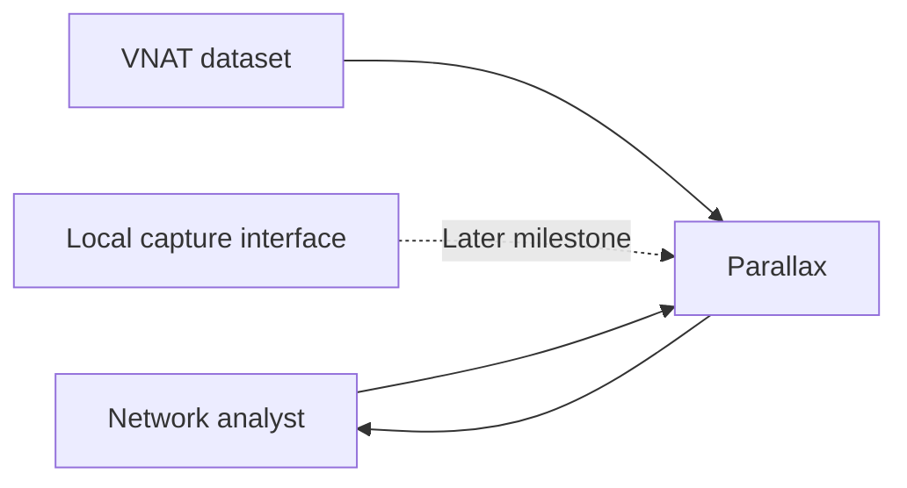
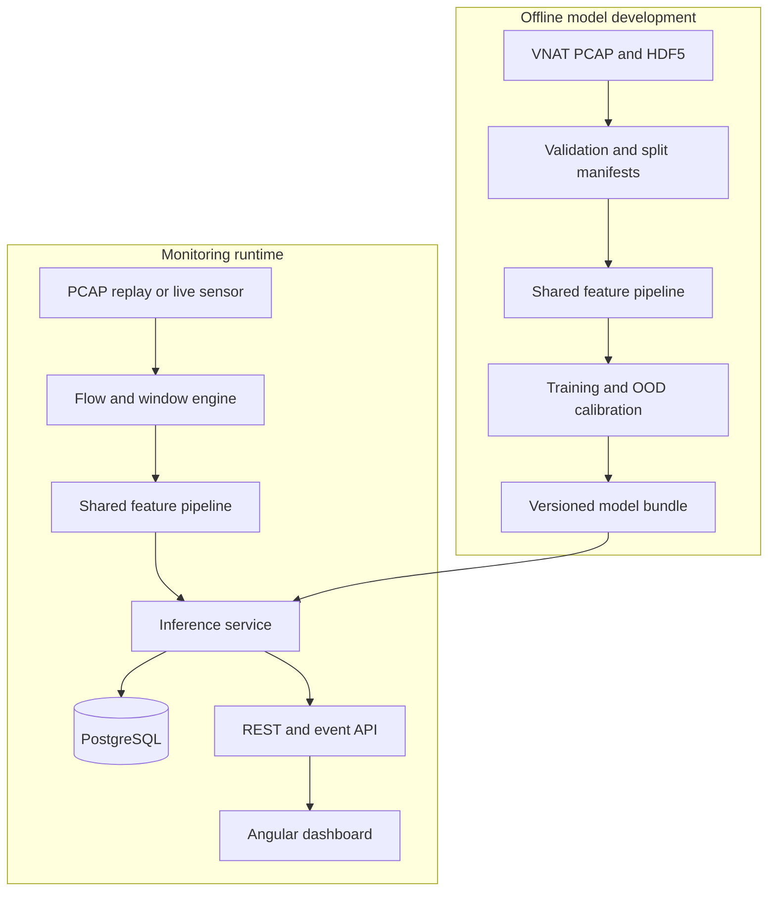
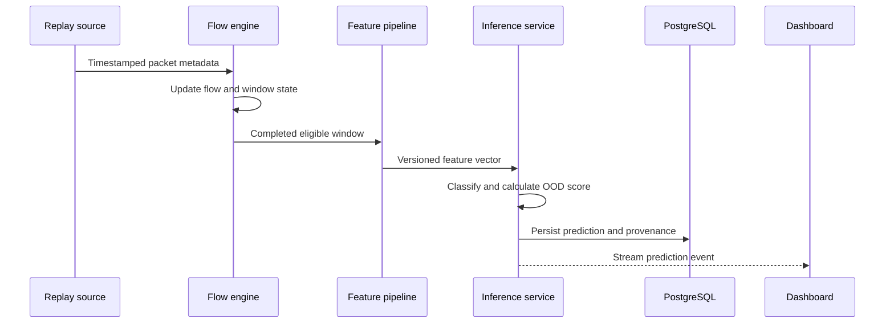

# Parallax

## Engineering Design Document

| Field | Value |
| --- | --- |
| Project name | Parallax |
| Document version | 0.4 |
| Status | Implemented through deterministic replay runtime inference |
| Date | 2026-09-09 |
| Owner | Josh Schultz |
| Intended repository | `Parallax` |
| Initial development environment | Windows 11 with WSL 2 Ubuntu 24.04 |

> This is a living engineering design. Implemented behavior is distinguished from planned
> operator-layer and live-capture work so the document describes the system as built rather
> than presenting future components as completed.

## 1. Executive Summary

Parallax is an uncertainty-aware network traffic monitoring system. It classifies application activity using observable packet metadata such as timing, size, and direction without decrypting or persisting packet payloads. It also calculates an out-of-distribution (OOD) score so the system can distinguish between a confident prediction and traffic that does not resemble anything represented in the training data.

The initial release will use the MIT Lincoln Laboratory VPN/Non-VPN Network Application Traffic Dataset (VNAT). The system will begin with deterministic replay of prerecorded PCAP files. Packets will be grouped into bidirectional flows and fixed observation windows, transformed into statistical and wavelet features, evaluated by a versioned model, and displayed in an Angular operations dashboard.

The project has two equally important goals:

1. Produce a technically defensible study of encrypted traffic classification and uncertainty.
2. Demonstrate the engineering required to turn an ML experiment into a tested, observable, reproducible application.

This is not intended to be presented as a production intrusion-detection system or malware detector. The initial data contains a small, controlled set of applications and broad traffic categories. The system will make its claim boundaries and limitations explicit.

### 1.1 Current implementation checkpoint

Milestones 1 through 4 are complete. The implemented runtime now supports:

- Metadata-only classic Raw-IP VNAT PCAP parsing for supported IPv4 ICMP, TCP, and UDP traffic.
- Deterministic bidirectional flow construction with first-observed orientation.
- Incremental capture-relative observation windows using the release-compatible eligibility policy.
- The same 129-feature calculation used by the accepted offline feature path.
- Deterministic replay at configured or maximum speed with pause, resume, cancel, completion,
  and structured failure states.
- Checksum- and provenance-verified loading of the accepted frozen prototype model and OOD
  calibration artifacts.
- CPU runtime scoring that returns raw class probabilities, selected category, raw confidence,
  relative-Mahalanobis distance, and OOD score.
- Stable runtime prediction events carrying session, window, model, calibration, feature-artifact,
  and split-manifest identity.
- Lifecycle-safe replay integration: completed sessions flush final eligible windows, while
  cancelled or failed sessions do not turn incomplete buffered state into final predictions.

Selected acceptance captures demonstrated exact batch/runtime feature parity: five eligible SSH
windows and 45 eligible VoIP windows matched exactly with maximum absolute feature difference
`0.0`.

The external API/event transport, operational persistence, Angular dashboard, and live network
sensor remain later work. Milestone 5 begins with the operator service and dashboard; live capture
remains Milestone 6.

## 2. Background

Encryption protects packet contents, but encrypted connections continue to expose metadata. Packet timing, direction, size, bursts, idle periods, and other flow characteristics may retain patterns associated with the generating application.

The VNAT dataset contains labeled VPN and non-VPN packet captures for ten applications grouped into five traffic categories:

| Traffic category | Applications |
| --- | --- |
| Streaming | Vimeo, Netflix, YouTube |
| Voice over IP | Zoiper |
| Chat | Skype |
| Command and control | SSH, RDP |
| File transfer | SFTP, RSYNC, SCP |

The dataset page reports approximately 36.1 GB of PCAP data, 33,711 connections, and 272 hours of capture. It also provides:

- A raw PCAP archive
- An HDF5 DataFrame containing connections, packet timestamps, packet sizes, and directions
- An HDF5 feature DataFrame containing derived ML features

The accompanying paper describes a prototypical neural network operating on statistical and wavelet features. It uses predictive confidence for known-class uncertainty and a relative Mahalanobis-distance method for detecting OOD traffic.

### 2.1 References

- [MIT Lincoln Laboratory VNAT dataset](https://www.ll.mit.edu/r-d/datasets/vpnnonvpn-network-application-traffic-dataset-vnat)
- [Extensible Machine Learning for Encrypted Network Traffic Application Labeling via Uncertainty Quantification](https://doi.org/10.1109/TAI.2023.3244168)

## 3. Problem Statement

A network analyst can observe that encrypted packets are moving across a network but cannot directly determine the application category from their contents. A conventional closed-set classifier may always select one of its known classes, even when the traffic came from an unseen application or category. That behavior can create confident but misleading results.

The project must therefore answer two questions for every eligible observation window:

1. Which known traffic category most closely matches this activity?
2. Does this activity resemble the data on which the model was trained closely enough to trust that classification?

## 4. Product Definition

### 4.1 Primary user

The initial user is a network or security analyst evaluating recorded traffic in a controlled environment. The user needs to see classifications, confidence, uncertainty, system health, and the model version responsible for each result.

### 4.2 First operational target

Given a labeled or unlabeled PCAP file, the system shall replay the traffic through the production feature and inference path, classify completed observation windows, calculate predictive confidence and an OOD score, persist operational results, and update an operations dashboard without inspecting or storing packet payload contents.

### 4.3 Primary use cases

- Replay a VNAT capture at a selected speed.
- Observe traffic-category predictions as replay progresses.
- Identify low-confidence or high-OOD windows.
- Review prediction history for a replay session.
- Compare model output with known VNAT labels during evaluation.
- Inspect the active model version and feature-schema version.
- Export evaluation metrics and charts for the project report.

### 4.4 Non-goals for the initial release

- Detect malware or prove that traffic is malicious.
- Inspect, decrypt, classify, or store application payload content.
- Identify every application on the public Internet.
- Identify individual users or recover message content.
- Separate multiple simultaneous applications multiplexed through one VPN tunnel.
- Provide subsecond classification.
- Automatically block, throttle, or terminate network connections.
- Serve as a production authorization or enforcement system.
- Depend on a GPU for runtime inference or continuous integration.
- Deploy a distributed message broker or Kubernetes cluster.

## 5. Design Principles

1. **Uncertainty is a first-class output.** A category prediction without its confidence and OOD context is incomplete.
2. **Training and serving use identical transformations.** Feature generation must be implemented once and shared by offline and runtime paths.
3. **Capture-level separation prevents leakage.** Observation windows from the same source capture must not cross training, validation, and test boundaries in the primary evaluation.
4. **Replay precedes live capture.** Deterministic PCAP replay will validate the complete runtime before operating-system capture complexity is introduced.
5. **Payloads are unnecessary and private.** The system will retain only the metadata required by the experiment.
6. **Claims remain bounded by evidence.** Results on VNAT will not be generalized to arbitrary enterprise networks without separate validation.
7. **Every prediction is traceable.** Model version, feature version, input window, time, and session must be recorded.
8. **The system fails explicitly.** Invalid captures, incompatible models, malformed features, and processing overload must surface as structured errors.
9. **CI remains hardware-independent.** Unit and integration tests will run without PCAP privileges or GPU hardware.

## 6. Requirements

### 6.1 Functional requirements

| ID | Requirement | Initial priority |
| --- | --- | --- |
| FR-001 | Load and validate the supplied VNAT feature HDF5 dataset. | Required |
| FR-002 | Infer traffic category, application, VPN status, and capture identity from documented labels and filenames. | Required |
| FR-003 | Generate deterministic train, validation, calibration, and test manifests. | Required |
| FR-004 | Prevent capture identity from crossing partitions in the primary evaluation. | Required |
| FR-005 | Train and evaluate conventional baseline classifiers. | Required |
| FR-006 | Train an uncertainty-aware model that emits class probabilities and an OOD score. | Required |
| FR-007 | Save a versioned model bundle with preprocessing and feature-schema metadata. | Required |
| FR-008 | Parse PCAP input and construct bidirectional flows without retaining payloads. | Required |
| FR-009 | Segment eligible flows into versioned observation windows. | Required |
| FR-010 | Calculate the same feature representation in training and runtime execution. | Required |
| FR-011 | Replay PCAP traffic at controlled and maximum speeds. | Required |
| FR-012 | Expose health, replay, prediction, session, and model APIs. | Required |
| FR-013 | Stream ordered runtime events to the dashboard. | Required |
| FR-014 | Display classifications, confidence, OOD scores, replay state, and service health. | Required |
| FR-015 | Persist operational sessions, predictions, errors, and model identity. | Required |
| FR-016 | Export evaluation results in machine-readable and human-readable formats. | Required |
| FR-017 | Capture traffic from a live local interface through a least-privilege sensor. | Later milestone |
| FR-018 | Add newly labeled applications or categories through a controlled retraining workflow. | Later milestone |

### 6.2 Nonfunctional requirements

| ID | Requirement | Proposed verification |
| --- | --- | --- |
| NFR-001 | Reproducible training | Fixed manifests, recorded seeds, locked dependencies, and repeat-run comparison |
| NFR-002 | Training-serving parity | Golden feature fixtures processed by offline and runtime entry points |
| NFR-003 | Runtime traceability | Every prediction includes model, schema, session, and window identifiers |
| NFR-004 | Privacy by default | Automated checks and review confirm that payload bytes are not persisted |
| NFR-005 | Bounded resource use | Queues, active flows, and retained events have configured upper bounds |
| NFR-006 | Failure isolation | A corrupt capture or flow cannot terminate the API or dashboard |
| NFR-007 | CPU compatibility | Complete test suite and inference smoke test pass without CUDA |
| NFR-008 | Observability | Structured logs, health endpoints, counters, and processing-latency measurements |
| NFR-009 | Maintainability | Typed contracts, documented modules, tests, migrations, and ADRs |
| NFR-010 | Safe local operation | Privileged packet capture is isolated from unprivileged API and dashboard processes |

## 7. Proposed Technology Stack

| Concern | Selection | Rationale |
| --- | --- | --- |
| Development environment | WSL 2 Ubuntu 24.04 on Windows | Matches the existing development workflow |
| Core language | Python | Strong packet, scientific, ML, and API ecosystem |
| Dependency management | `uv` with `pyproject.toml` and lock file | Reproducible and fast environment setup |
| Dataset access | pandas and PyTables | Direct support for supplied HDF5 files |
| PCAP parsing | `dpkt` | Lightweight packet parsing and alignment with the paper |
| Numerical processing | NumPy and SciPy | Numerical and statistical operations |
| Wavelet features | PyWavelets | Reproduction of wavelet feature construction |
| Baseline ML | scikit-learn | Baselines, metrics, calibration, and preprocessing |
| Neural ML | PyTorch | Prototypical network and learned embedding implementation |
| Experiment tracking | MLflow | Record parameters, metrics, artifacts, and model candidates |
| API | FastAPI and Pydantic | Typed REST and event contracts |
| Persistence | PostgreSQL, SQLAlchemy, and Alembic | Durable operational records and migrations |
| Dashboard | Angular, TypeScript, RxJS, and ECharts | Tested operations UI with streaming state and charts |
| Deployment | Docker Compose and Nginx | Reproducible local and demonstration deployment |
| Quality | pytest, Ruff, mypy, Playwright | Unit, static, integration, and browser testing |
| CI | GitHub Actions | CPU-only validation on each pull request |

### 7.1 Explicitly deferred technologies

The initial architecture will not use Kafka, Kubernetes, Redis, a service mesh, or a Rust data plane. The design will keep component boundaries clean enough to introduce a broker or higher-performance sensor only if measurements demonstrate a need.

## 8. System Architecture

### 8.1 System context



### 8.2 Offline and runtime architecture



### 8.3 Runtime prediction sequence



## 9. Component Responsibilities

### 9.1 Dataset manager

- Validate expected dataset files and checksums.
- Read HDF5 metadata and features.
- Derive normalized labels from filenames.
- Produce immutable split manifests.
- Generate dataset profiles and imbalance reports.
- Prevent raw data from being committed to Git.

### 9.2 PCAP replay engine

- Read PCAP records in timestamp order.
- Support maximum speed and configured time scaling.
- Emit pause, resume, completion, cancellation, and error events.
- Maintain a stable session identifier.
- Apply bounded buffering and backpressure.
- Never silently skip malformed records.

### 9.3 Flow and window engine

- Parse supported link, IP, and transport headers.
- Normalize bidirectional flow identity.
- Establish a deterministic forward direction.
- Track packet timestamp, size, and direction only.
- Close inactive flows and expire stale state.
- Generate stable observation-window identifiers.
- Discard or mark windows that do not satisfy eligibility rules.

### 9.4 Feature pipeline

- Implement versioned statistical features.
- Implement versioned wavelet features.
- Validate feature names, order, types, and dimensions.
- Serialize the feature schema with every model bundle.
- Provide identical entry points for training and runtime inference.
- Reject incompatible model and feature versions.

### 9.5 Training and evaluation pipeline

- Train baseline and neural models from explicit manifests.
- Record dependencies, parameters, seeds, metrics, and artifacts.
- Fit probability and OOD calibration using calibration-only data.
- Produce confusion matrices, calibration plots, and OOD distributions.
- Export a versioned, immutable model candidate.

### 9.6 Inference service

- Load and verify one active model bundle.
- Accept only compatible, validated feature vectors.
- Return category probabilities, selected category, confidence, and OOD score.
- Record latency, errors, model version, and feature version.
- Persist predictions before publishing completion events.
- Remain functional on CPU-only hosts.

### 9.7 API and event service

- Expose versioned REST endpoints.
- Publish ordered events to connected dashboard clients.
- Provide snapshots for clients that reconnect after missing events.
- Validate all request and response contracts.
- Avoid exposing raw control or database credentials to the browser.

### 9.8 Operations dashboard

- Show replay state and processing progress.
- Show a time-ordered traffic-category timeline.
- Plot confidence and OOD score independently.
- Distinguish high confidence from low OOD; neither substitutes for the other.
- Display model, feature, and session identity.
- Surface dropped, invalid, and failed windows.
- Make replayed and live data visually unambiguous.

## 10. Data Design

### 10.1 Data retained at runtime

| Data | Retention decision |
| --- | --- |
| Packet payload bytes | Never persisted |
| Full packet headers | Not persisted by default |
| Raw IP addresses | Not persisted by default; optional pseudonymization may be evaluated later |
| Flow identifier | Deterministic session-local pseudonymous identifier |
| Packet timestamps | Retained only as required for window features and aggregated results |
| Packet sizes and directions | Used for feature calculation; raw sequence retention configurable and off by default |
| Feature vectors | Optional for evaluation sessions; disabled for ordinary monitoring by default |
| Predictions and uncertainty | Persisted |
| Model and schema identity | Persisted |
| Errors and operational metrics | Persisted with bounded retention |

### 10.2 Primary operational entities

- **ModelVersion:** model identifier, training manifest, feature schema, calibration artifact, metrics, checksum, creation time.
- **ReplaySession:** source identity, replay rate, state, start/end time, counters, active model.
- **ObservationWindow:** session-local window identity, flow identity, time range, eligibility status, feature version.
- **Prediction:** selected category, class probabilities, confidence, OOD score, latency, model version.
- **OperationalEvent:** ordered session event containing state changes, warnings, and failures.

### 10.3 Model bundle

Every deployable model bundle must contain:

- Model weights or serialized estimator
- Model architecture identifier
- Model semantic version
- Feature-schema version and ordered feature list
- Preprocessing parameters
- Class-to-index mapping
- OOD calibration artifacts
- Training split-manifest checksum
- Dependency and runtime metadata
- Evaluation summary
- Bundle checksum

## 11. Machine Learning Design

### 11.1 Prediction hierarchy

The primary initial task is five-category classification. Application and VPN labels will be retained for analysis and experimental slicing, not necessarily as first-release runtime outputs.

Each prediction returns:

- Probability for each known category
- Selected known category
- Predictive confidence
- OOD score
- Model version
- Feature-schema version

Predictive confidence and OOD score measure different risks. A model may confidently select the nearest known category while the sample remains far outside its training distribution.

### 11.2 Baselines

The project will establish progressively stronger baselines:

1. Majority-class predictor
2. Multinomial logistic regression
3. Random forest
4. Gradient-boosted decision tree, subject to dependency review
5. Small fully connected neural network

The first two baselines are implemented. On the capture-held-out validation partition, balanced
logistic regression reaches 93.42% accuracy, 73.31% balanced accuracy, and 0.745 macro F1. These
are validation reference values only; the baseline workflow does not access calibration or test.
Configuration, per-category results, confusion matrices, provenance, and limitations are documented in
[Initial VNAT Validation Baselines](baseline-modeling.md).

The prototype candidate improves validation balanced accuracy to 87.89% and macro F1 to 0.808.
Its one-shot capture-held-out test result is 82.08% balanced accuracy and 0.713 macro F1. The
validation-to-test decline and category-specific failures remain part of the accepted evidence.

### 11.3 Primary uncertainty model

The paper's general method is implemented as the first uncertainty-aware candidate:

- Fully connected embedding network
- Class prototypes calculated in embedding space
- Distance-based class probabilities
- Relative Mahalanobis distance for OOD ranking
- Class-conditional OOD calibration distributions fitted only on held-out calibration data
- Interpretable OOD score derived from the calibration distribution

The accepted implementation uses a deterministic four-layer 64-unit embedding network, 20,000
episodes, training-only standardization and class geometry, calibration-only Gaussian KDEs over
relative Mahalanobis distance, and fixed OOD thresholds of 0.95 and 0.99. Raw class probabilities
are not temperature-scaled. The final known-traffic test false-positive rates are 0.45% and 0%,
respectively, but no true OOD examples are present. See
[VNAT Prototype and Uncertainty Evaluation](uncertainty-modeling.md).

### 11.4 Observation and feature design

The reproduction target follows the paper's approach:

- 40.96-second observation windows
- 10-millisecond time bins
- Minimum of 20 packets per window
- Forward and backward packet directions
- Aggregate flow statistics
- Stationary wavelet features across selected frequency bands
- Versioned ordered feature vector

Shorter windows may be evaluated later to quantify the latency/accuracy tradeoff. The default will not change without comparative evidence.

## 12. Evaluation Methodology

### 12.1 Dataset partitions

Four logical partitions are required:

| Partition | Purpose |
| --- | --- |
| Training | Learn model parameters |
| Validation | Select architecture and hyperparameters |
| Calibration | Fit OOD density calibration only; perform no model selection |
| Test | Final locked evaluation |

The primary evaluation groups by source capture so windows from one capture cannot cross
partitions. The accepted model was selected on validation, calibrated without validation or test
access, and evaluated once on test only after the candidate, thresholds, and report policy were
frozen.

The implemented `vnat-capture-split-1` contract targets 60% training, 15% validation, 10%
calibration, and 15% test windows. It treats each capture as indivisible and enforces category
coverage in every partition, application coverage in training and test, both VPN statuses in
every partition, and every category/VPN combination in training. Soft balance objectives account
for category windows, category capture counts, overall windows and captures, and VPN-status
windows. The immutable manifest records the source checksum, exact configuration, solver result,
all assignments, and distribution summaries.

For comparison with the paper, a separate randomized-window experiment may be reported. It must be labeled clearly and must not replace the capture-held-out result.

### 12.2 Closed-set metrics

- Micro F1
- Macro F1
- Per-category precision, recall, and F1
- Balanced accuracy
- Confusion matrix
- Expected calibration error
- Brier score
- Model size
- Training time
- CPU inference latency distribution

### 12.3 Open-set and OOD evaluation

OOD behavior will be evaluated using leave-one-application-out studies. An application will be excluded from training and treated as unseen during evaluation.

Candidate studies include:

- Hold out YouTube while retaining Netflix and Vimeo.
- Hold out SCP while retaining SFTP and RSYNC.
- Hold out SSH while retaining RDP.
- Hold out one entire category as a more difficult experiment.

Metrics will include:

- AUROC for in-distribution versus OOD separation
- Area under the precision-recall curve
- False-positive rate at a selected true-positive rate
- OOD recall at the documented operating threshold
- Known-class accuracy after OOD rejection
- Coverage versus accepted-prediction accuracy

The operating threshold must be selected on validation/calibration data, never on the final test set.

### 12.4 Robustness studies

- Uniform packet-size masking
- Timing jitter
- Reduced observation-window duration
- VPN-only and non-VPN-only evaluation
- Train on VPN and test on non-VPN, and the reverse
- Class-imbalance sensitivity
- Feature-ablation study
- Corrupt and truncated PCAP handling

### 12.5 Reproducibility

Every reported run must record:

- Git commit
- Dataset manifest checksum
- Split-manifest checksum
- Dependency lock checksum
- Random seeds
- Configuration
- Hardware summary
- Model bundle checksum
- Generated metrics and figures

## 13. API Draft

### 13.1 REST endpoints

```text
GET    /health
GET    /api/v1/models/active
GET    /api/v1/models
GET    /api/v1/sessions
GET    /api/v1/sessions/{sessionId}
POST   /api/v1/replays
POST   /api/v1/replays/{sessionId}/pause
POST   /api/v1/replays/{sessionId}/resume
POST   /api/v1/replays/{sessionId}/stop
GET    /api/v1/sessions/{sessionId}/predictions
GET    /api/v1/sessions/{sessionId}/events
WS     /api/v1/events
```

### 13.2 Prediction contract draft

```json
{
  "predictionId": "pred_01",
  "sessionId": "session_01",
  "windowId": "capture-17:204",
  "modelVersion": "0.1.0",
  "featureSchemaVersion": "vnat-wavelet-1",
  "category": "FILE_TRANSFER",
  "classProbabilities": {
    "CHAT": 0.01,
    "COMMAND_AND_CONTROL": 0.03,
    "FILE_TRANSFER": 0.91,
    "STREAMING": 0.02,
    "VOIP": 0.03
  },
  "confidence": 0.91,
  "oodScore": 0.08,
  "vpnStatus": "VPN",
  "inferenceLatencyMs": 4.2,
  "observedAt": "2026-08-18T19:20:00Z"
}
```

Names, identifiers, and optional fields remain provisional until API implementation begins.

## 14. Reliability and Failure Handling

### 14.1 Backpressure

The runtime will use bounded queues between packet replay, flow processing, feature extraction, and inference. When a queue reaches capacity, the system must apply a documented policy and emit a visible operational event. It must not grow memory without a bound.

### 14.2 Idempotency

Session and window identifiers will make repeated processing detectable. Database writes for the same prediction identity must be idempotent. A reconnected dashboard will obtain a snapshot plus events newer than its last observed sequence.

### 14.3 Model compatibility

The inference service must refuse to activate a model when:

- The bundle checksum fails.
- Required artifacts are missing.
- The feature schema is unsupported.
- Feature order or dimensions do not match.
- The model runtime is incompatible.
- Calibration artifacts do not match the model.

### 14.4 Restart behavior

The initial release may mark an interrupted replay as failed rather than resuming packet-perfect execution. The session history must remain readable after restart. Restart-safe replay checkpoints are a possible later milestone and must not be implied until tested.

## 15. Security and Privacy

### 15.1 Threat boundaries

The system processes potentially sensitive traffic metadata. Even without payloads, flow timing and endpoints can reveal behavior. Local-first operation is therefore the default.

### 15.2 Initial controls

- Do not persist packet payloads.
- Do not log raw payload buffers or authentication values.
- Keep raw captures outside the web-accessible filesystem.
- Run the API and dashboard without packet-capture privileges.
- Isolate privileged capture in a narrow sensor process.
- Validate PCAP paths and reject path traversal.
- Set upload and replay size limits.
- Authenticate any remotely accessible deployment.
- Keep browser clients separated from database and service credentials.
- Redact or pseudonymize endpoint identifiers in exported demonstrations.
- Use prerecorded public VNAT data for public demos.

### 15.3 Ethical presentation

Project materials must explain that traffic classification can support defensive visibility but can also enable surveillance or censorship. Encryption does not guarantee that behavioral metadata is private. The project will not claim to infer content, intent, identity, or maliciousness from a category prediction.

## 16. Observability

### 16.1 Logs

Services will emit structured JSON logs with:

- Timestamp
- Severity
- Service and component
- Session identifier when applicable
- Event name
- Stable error code
- Human-readable message
- Model and feature versions when applicable

Logs must avoid payloads, tokens, and raw packet buffers.

### 16.2 Metrics

- Packets read, accepted, and rejected
- Active and expired flows
- Completed, discarded, and failed windows
- Feature calculation latency
- Inference latency
- Queue depth and queue saturation
- Predictions by category
- High-OOD prediction count
- WebSocket clients and delivery failures
- Database write latency and failures

### 16.3 Health

Health reporting will distinguish:

- Process liveness
- Database readiness
- Active-model readiness
- Replay/sensor state
- Event-stream availability

## 17. Test Strategy

| Layer | Representative tests |
| --- | --- |
| Dataset | Schema validation, filename labels, checksums, class counts, invalid files |
| Partitioning | Determinism and proof of no capture identity overlap |
| Flow engine | Direction normalization, timeout, duplicate packets, malformed headers |
| Windows | Boundary timestamps, insufficient packets, stable identifiers |
| Features | Golden vectors, wavelet dimensions, NaN handling, offline/runtime parity |
| Training | Fixed-seed smoke test, artifact completeness, calibration isolation |
| Inference | Bundle validation, probability contract, OOD score range, CPU execution |
| Replay | Timing scale, pause/resume/stop, corruption, bounded queue behavior |
| Database | Migration, idempotent prediction writes, transactional session changes |
| API | Contract validation, error codes, pagination, health state |
| Event stream | Ordering, reconnect snapshot, slow client, client isolation |
| Dashboard | State rendering, reconnect behavior, charts, accessibility |
| End to end | Small PCAP fixture through persisted prediction and visible event |
| Performance | One-times-real-time replay on the reference development machine |

CI will use small, redistribution-safe fixtures rather than the complete VNAT dataset.

## 18. Proposed Repository Structure

```text
Parallax/
  .github/
    workflows/
  apps/
    api/
    dashboard/
  configs/
  data/
    README.md
    manifests/
  docs/
    adr/
    engineering-design.md
    model-card.md
    dataset-card.md
    threat-model.md
  models/
    README.md
  packages/
    traffic_core/
      dataset/
      evaluation/
      features/
      flows/
      inference/
      models/
      replay/
      schemas/
      training/
  scripts/
  tests/
    fixtures/
    integration/
    unit/
  compose.yml
  pyproject.toml
  README.md
```

Generated datasets, raw captures, model weights, secrets, and local databases will be ignored by Git.

## 19. Delivery Plan

### Milestone 0: Design baseline

Deliverables:

- Engineering design version 0.1
- Initial decision log
- Working project name
- Repository and CI skeleton
- Documented first operational target

Exit criteria:

- Goals, non-goals, architecture, and initial acceptance criteria are agreed.

### Milestone 1: Dataset contract and baseline

Deliverables:

- Feature HDF5 loader
- Dataset profile
- Label contract
- Capture-level split manifests
- Leakage checks
- Baseline-model report

Exit criteria:

- A clean checkout can reproduce the baseline metrics from a documented command.

This exit criterion is satisfied by the manifest-bound dataset loader and deterministic
`parallax model validate-baselines` report workflow.

### Milestone 2: Uncertainty-aware modeling

Deliverables:

- Prototypical model reproduction - complete
- Raw-probability calibration diagnostics and OOD density calibration - complete
- One-shot capture-held-out test evaluation - complete
- Leave-one-application-out OOD detection study - deferred as a separate pre-registered experiment
- Versioned model and calibration bundles - complete
- Model card and immutable experiment record - complete

Exit criteria:

- OOD behavior is evaluated separately from closed-set accuracy and documented honestly.

The core exit criterion is satisfied for calibration and known-traffic false-positive behavior.
OOD detection power remains explicitly unmeasured until an application-held-out or external OOD
experiment is separately frozen and executed.

### Milestone 3: Raw PCAP pipeline

Status: engineering complete; selected-capture parity demonstrated.

Completed deliverables:

- Strict classic Raw-IP PCAP parser for supported IPv4 ICMP, TCP, and UDP traffic
- Release-compatible and corrected packet-size policies
- Deterministic bidirectional flow construction
- Adapter into the shared capture-aligned window engine
- Immutable runtime 129-feature construction
- Synthetic golden fixtures
- Exact real-PCAP flow, window, and feature parity on selected SSH and VoIP training captures

The selected SSH capture produced 117 exact flows and five exact eligible feature vectors. The
selected VoIP capture produced 108 exact flows, including two ICMP flows containing 404 ICMP
packets, and 45 exact eligible UDP feature vectors. Maximum feature difference was `0.0` for both
acceptance captures.

The current path is intentionally batch-oriented. It materializes capture flow metadata before
window and feature extraction and must not be described as timed replay, bounded streaming, or
live capture.

Exit criteria:

- Selected raw PCAP windows produce feature vectors consistent with the offline pipeline. Satisfied.

### Milestone 4: Replayable runtime

Deliverables:

- Replay engine
- Inference API
- PostgreSQL persistence
- Ordered event stream
- End-to-end integration tests

Exit criteria:

- A VNAT PCAP can be replayed through the complete backend and produces traceable predictions.

### Milestone 5: Operations dashboard

Deliverables:

- Replay controls
- Prediction timeline
- Confidence and OOD displays
- Health and model information
- Reconnect behavior
- Browser tests

Exit criteria:

- A reviewer can run a documented demonstration and understand what the system predicts, how uncertain it is, and which model produced the result.

### Milestone 6: Live sensor and hardening

Deliverables:

- Least-privilege local sensor
- Live monitoring mode
- Performance characterization
- Threat/privacy review
- Failure and restart testing

Exit criteria:

- Live metadata can be processed at the measured reference rate without elevated privileges in the API or UI components.

### Milestone 7: Portfolio release

Deliverables:

- Release tag
- Polished README
- As-built engineering report
- Dataset and model cards
- Architecture diagrams
- Evaluation figures
- Demonstration video
- Limitations and future-work section

Exit criteria:

- All public claims are linked to reproducible evidence, and a new user can run the demonstration from the documentation.

## 20. Initial Release Acceptance Criteria

The first portfolio release is acceptable when:

1. A clean environment can install locked dependencies using documented commands.
2. CI passes without GPU hardware, capture privileges, or the full private workspace.
3. Raw VNAT data and trained weights are not committed to Git.
4. Dataset and split manifests make the primary evaluation reproducible.
5. Automated tests prove that capture identities do not cross primary data partitions.
6. At least one conventional baseline and one uncertainty-aware model are evaluated.
7. Closed-set, calibration, and OOD results are reported separately.
8. Offline and runtime feature generation pass golden parity tests.
9. A small PCAP fixture passes through replay, inference, persistence, API, event stream, and dashboard.
10. A full VNAT demonstration capture can replay at one-times-real-time on the reference CPU without unbounded memory growth.
11. Every stored prediction identifies its model, feature schema, session, and observation window.
12. The dashboard clearly distinguishes predictive confidence from the OOD score.
13. No packet payload is stored in the operational database or ordinary logs.
14. Failure modes produce structured errors and visible operational events.
15. The model card, dataset card, threat model, and known limitations are complete.

No target accuracy is declared in advance. Baseline results will determine realistic performance gates. This avoids choosing success criteria from the paper's reported test result before reproducing its data partitioning and checking for capture-level leakage.

Criteria 1 through 7 are now implemented, with criterion 7 bounded to known-traffic OOD
false-positive behavior. OOD detection power, runtime parity, and the operational criteria remain
future work.

## 21. Architecture Decision Record Index

The following initial decisions should be recorded as individual ADRs when the repository is created:

| ADR | Decision | Status |
| --- | --- | --- |
| ADR-001 | Use Python for packet, feature, training, and inference core | Proposed |
| ADR-002 | Use Angular for the analyst dashboard | Proposed |
| ADR-003 | Share one versioned feature pipeline between training and runtime | Proposed |
| ADR-004 | Use capture-held-out partitions as the primary evaluation | Proposed |
| ADR-005 | Implement deterministic replay before live packet capture | Proposed |
| ADR-006 | Keep inference and CI CPU-compatible | Proposed |
| ADR-007 | Persist metadata and predictions, not packet payloads | Proposed |
| ADR-008 | Use PostgreSQL for operational state | Proposed |
| ADR-009 | Defer Kafka, Kubernetes, and Rust until measurements justify them | Proposed |

## 22. Open Questions

| ID | Question | Decision point |
| --- | --- | --- |
| OQ-002 | Resolved: the supplied feature HDF5 does not retain capture identity; Parallax reconstructs features from capture-labeled raw data. | Milestone 1 |
| OQ-003 | Resolved: accepted source identities and checksums are versioned in the VNAT release manifest. | Milestone 1 |
| OQ-004 | Should MLflow remain a development-only service or ship in the demonstration stack? | Milestone 2 |
| OQ-005 | Partially resolved: 0.95 and 0.99 are frozen reference thresholds; comparative application-held-out evidence remains future work. | Separate OOD study |
| OQ-006 | Resolved: selected SSH and VoIP raw PCAPs reproduce offline flow, window, and 129-feature records exactly under the release-compatible contracts. | Milestone 3 |
| OQ-007 | Should runtime feature vectors be retained for public demo sessions? | Milestone 4 security review |
| OQ-008 | Is WebSocket replay sufficient, or is a replayable server-sent event stream simpler for the final UI? | Milestone 4 |
| OQ-009 | What Windows capture mechanism provides the cleanest least-privilege boundary? | Milestone 6 |
| OQ-010 | Which metrics and views materially help an analyst rather than merely decorating the dashboard? | Milestone 5 usability review |

## 23. Known Risks

| Risk | Impact | Mitigation |
| --- | --- | --- |
| Controlled testbed does not represent current enterprise traffic | Inflated generalization claims | Explicit limitations and external/held-out studies |
| Windows from the same capture leak across partitions | Artificially high metrics | Capture-grouped manifests and automated overlap checks |
| Labels come from filenames rather than per-window observation | Incorrect labels for inactive or mixed windows | Eligibility rules, label audit, and cautious interpretation |
| Category imbalance distorts aggregate metrics | Misleading micro averages | Macro metrics, per-class results, and balanced analysis |
| OOD evaluation uses examples too different from known traffic | Unrealistically easy detection | Near-OOD leave-one-application-out tests |
| Training/runtime feature drift | Deployment predictions differ from experiments | Shared feature package and golden parity tests |
| Live capture requires elevated privileges | Larger attack surface | Narrow sensor process and unprivileged remaining services |
| Dashboard implies more certainty than model supports | Analyst overtrust | Show confidence, OOD, provenance, and limitations together |
| Project expands before a working vertical slice | Delayed usable result | Enforce milestone exits and defer distributed infrastructure |

## 24. Documentation and Portfolio Package

The repository will eventually contain:

- `README.md`: problem, demonstration, architecture summary, verified results, and setup
- `docs/engineering-design.md`: this document, maintained as the system evolves
- `docs/dataset-card.md`: provenance, schema, imbalance, label design, and limitations
- `docs/model-card.md`: intended use, metrics, calibration, OOD behavior, and exclusions
- `docs/threat-model.md`: assets, trust boundaries, privacy risks, and controls
- `docs/evaluation-report.md`: experimental methodology and results
- `docs/performance-report.md`: replay rate, memory, latency, and failure behavior
- `docs/adr/`: important technical decisions and their tradeoffs
- Architecture, sequence, deployment, data-lineage, and ML-lifecycle diagrams
- Dashboard screenshots and a short recorded demonstration

The final as-built report should clearly separate measured results from planned or future capabilities.

## 25. Immediate Next Step

Close Milestone 3 by publishing its PCAP provenance and parity evidence, passing the aggregate
branch quality gate, and merging the raw-PCAP feature branch. Then begin Milestone 4 with the
replay-session identity, state-machine, configuration, timing, and terminal-error contracts before
adding infrastructure dependencies.

The operational replay path must be incremental and bounded rather than relying on whole-capture
materialization. The existing batch PCAP implementation remains the parity oracle. The frozen
model and calibration artifacts must not be changed to accommodate runtime discrepancies.

---

## Revision History

| Version | Date | Summary |
| --- | --- | --- |
| 0.1 | 2026-08-18 | Initial project definition, architecture, requirements, evaluation plan, security boundaries, milestones, and acceptance criteria |
| 0.2 | 2026-08-18 | Adopted Parallax as the permanent project and repository name |
| 0.3 | 2026-08-23 | Recorded the implemented baseline, frozen prototype, calibration-only OOD workflow, one-shot test evidence, and Milestone 3 handoff |
| 0.4 | 2026-09-03 | Recorded raw-PCAP provenance, ICMP and UDP compatibility behavior, exact selected-capture feature parity, Milestone 3 completion, and Milestone 4 handoff |
